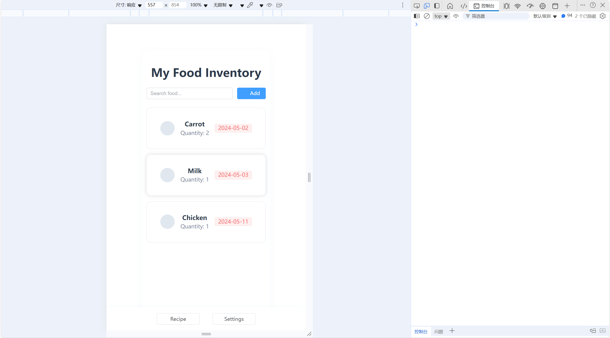
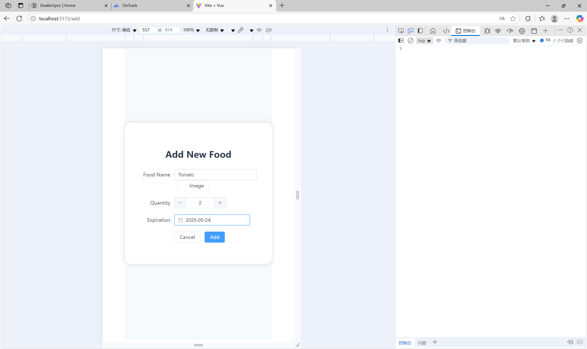
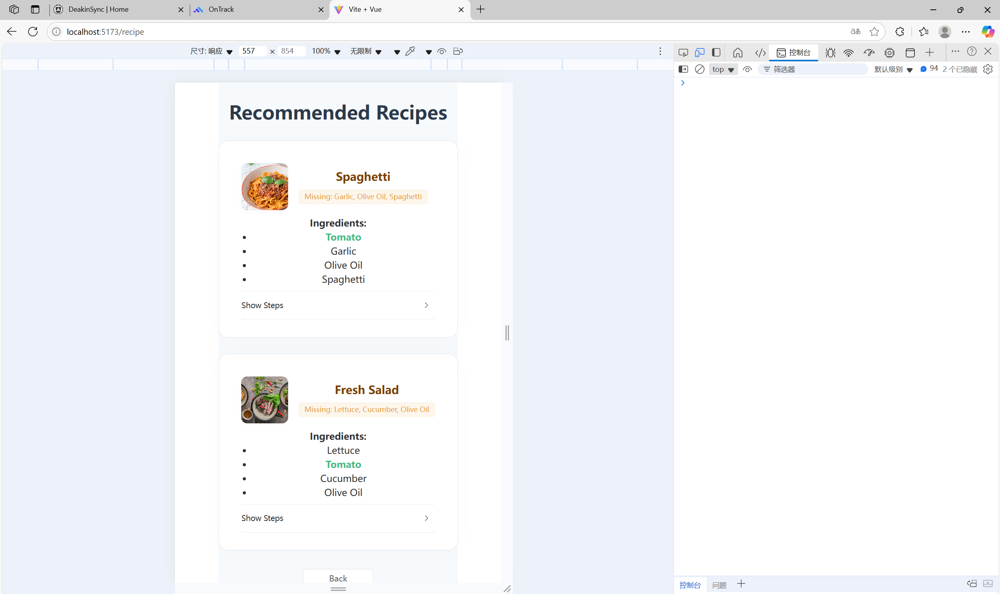

# EcoBite: Smart Food Inventory Management System (High-fidelity Prototype)

EcoBite is a high-fidelity web application designed to help users efficiently manage their home food inventory, reduce waste, and get intelligent recipe recommendations. Users can easily add, search, and manage food items. The system recommends recipes based on current inventory and provides data visualization to help users understand their food usage.

## ✨ Features
- Food inventory management: add, search, and view food items with expiration dates
- Smart recipe recommendations: dynamic suggestions based on your inventory, with missing ingredients highlighted
- Data visualization: clear overview of inventory structure
- High-fidelity UI: modern card-based design, responsive layout
- Multi-language support (EN/CH)
- Notifications and user settings

## 🚀 Getting Started

### 1. Clone the repository
```bash
git clone https://github.com/your-username/ecobite.git
cd eco-bite
```

### 2. Install dependencies
```bash
npm install
```

### 3. Run in development mode
```bash
npm run dev
```

### 4. Build for production
```bash
npm run build
```

## 📸 Screenshots

Home | Add Food | Recipe | Settings
:---:|:---:|:---:|:---:
 |  |  | 


## 🛠️ Tech Stack
- [Vue 3](https://vuejs.org/)
- [Element Plus](https://element-plus.org/)
- [Pinia](https://pinia.vuejs.org/)
- [ECharts](https://echarts.apache.org/)
- [Vite](https://vitejs.dev/)

## 📄 Documentation & Prototype
- [High-Fidelity Prototype Documentation (PDF)](./docs/HighFidelityPrototype.pdf)
- [Demo Video Link](./docs/DemoVideo.pdf)

## 👤 Author
- name: Tianwei Pan 
- email: s224387234@deakin.edu.au

---

> This project is a high-fidelity prototype assignment for the SIT317/SIT726 Information Technology Innovations and Entrepreneurship course. For questions or suggestions, feel free to open an issue!
